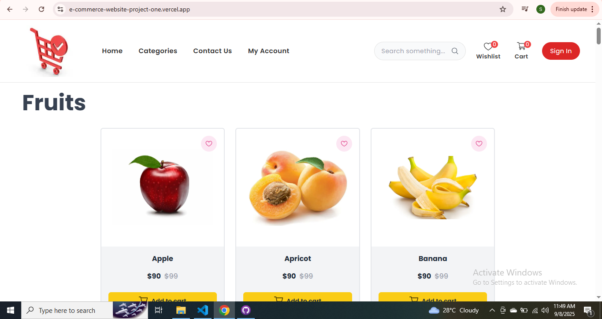

🛒 E-Commerce Website

A responsive e-commerce web application built with Next.js / React / Tailwind CSS.
This project demonstrates core frontend features of an e-commerce platform such as product browsing, cart, wishlist, and checkout flow.

⚡ Note: This is a frontend-only demo project. Authentication, backend APIs, and database integrations are not implemented. Some features are mock (static / UI-only).

✨ Features

📦 Product Listing – Browse products in a clean UI

🔍 Search Bar (Mock) – UI available, but not functional

❤️ Add to Wishlist – Add/remove items (UI functionality only)

🛒 Add to Cart – Add items to cart and view cart summary

💳 Checkout Page – Checkout flow UI designed (no backend logic)

👤 User Account (Mock) – Sign in / Sign up forms created as static components

🖼️ Screenshots

🛠️ Tech Stack

Framework: Next.js (React)

Styling: Tailwind CSS

State Management: Context API 

Icons & UI: (e.g., React Icons, Heroicons)

🚀 Getting Started

Clone the repository:

git clone https://github.com/Aashra55/NextJS-Projects
cd ecommerce-website

Install dependencies:

npm install

Run locally:

npm run dev

📌 Limitations

🔒 No authentication (Sign In / Sign Up are mock forms)

🌐 No backend (products, wishlist, and cart are not persisted after reload)

🔎 Search bar is UI-only

🎯 Future Improvements

✅ Integrate a backend (Node.js / Express / Next.js API routes)

✅ Add authentication (JWT / NextAuth)

✅ Connect to a database (MongoDB / PostgreSQL)

✅ Make cart and wishlist persistent

✅ Implement real product search

🙌 Acknowledgements

This project was created for learning purposes and to demonstrate frontend skills.
It focuses on UI/UX and e-commerce workflows without backend logic.

## Check live:
https://e-commerce-website-project-one.vercel.app/

